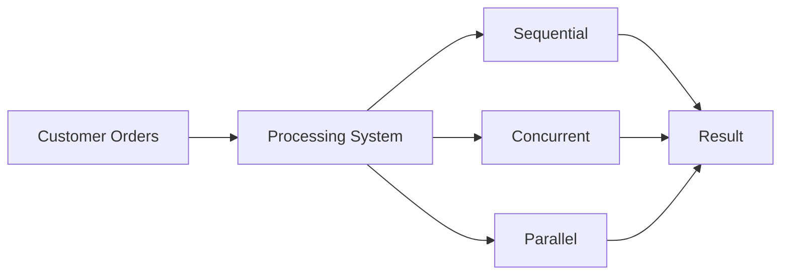

# 🚀 CONCURRENT AND PARALLEL FOOD ORDERING SYSTEM ANALYZING PERFORMANCE

<p align="center">
  
  
  
</p>

---
## 👤 Student Information
- **Name:** SITI NUR NAJWA HIDAYAH BINTI CHE ROHIM  
- **Subject:** ITT440 – Network Programming
- **Student ID:** 2024206854
- **Group:** M3CS2554B

---
## 🎥 Demo

Link: https://youtu.be/W_SN1bNRSiw?si=0PWHZ2RFLqtRJsG_

---

## 🍔 Project Overview

> “When thousands of customers order food at the same time… can your system keep up?”

This project simulates a food ordering system that processes a large number of customer orders and compares performance using different execution techniques.

---

## 📌 Introduction

This project simulates a food ordering system that processes 20,000 customer orders.  

The main objective is to analyze system performance using three different processing techniques:
- Sequential  
- Concurrent (Threading)  
- Parallel (Multiprocessing)  

The system uses an 8-core CPU, allowing parallel processing to execute tasks simultaneously and improve performance.

----

## 🎯 Objectives

- Implement multiple processing techniques  
- Simulate large-scale order handling  
- Measure execution performance  
- Compare efficiency between methods  

---

## ❗ Problem Statement

In real-world systems such as food delivery platforms, handling large volumes of orders using sequential processing can lead to slow performance and delays.

This project explores how concurrent and parallel processing can improve system efficiency.

---

## ⚙️ System Environment

| Parameter | Details |
|----------|--------|
| 💻 OS | Kali Linux / Windows |
| 🐍 Python | Python 3.x |
| ⚙️ CPU | 8-Core Processor |
| 🚀 Modes | Sequential, Threading, Multiprocessing |

---

## 🧠 System Flow



---
## 🧩 System Structure

| File           | Description                                |
| -------------- | ------------------------------------------ |
| `generator.py` | Generates food orders                      |
| `analyzer.py`  | Processes orders using multiple techniques |
| `main.py`      | Executes system and displays results       |


---
## 🧠 Code Insight

🔹 Parallel Processing Example

```python
with Pool(processes=cores) as pool:
    results = pool.map(process_order, orders, chunksize=200)'
```
✔ Distributes tasks across multiple CPU cores

✔ Reduces execution time

✔ Improves system performance

---
## 📊 Output Result
<p align="center">  </p>

---
## 📈 Performance Graph
<p align="center">  </p>

---
##🔍 Analysis
- Sequential → processes tasks one by one
- Concurrent → improves speed using threads
- Parallel → uses multiple CPU cores for true parallel execution

---
## 🏁 Conclusion

Parallel processing provides the best performance for large-scale systems by utilizing multiple CPU cores.

Sequential processing is inefficient, while concurrent processing offers moderate improvement.

